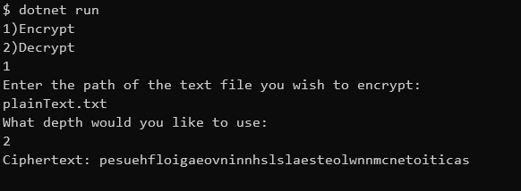

# RailFenceCipher
RailFenceCipher is a command line application that either decrypts or encrypts a given text file and depth by using the RailFence Cipher.  Not only will the generated text be shown in the application, but it will also be outputed to a text file.

## Requirements to run

You must have .NET downloaded and installed.

From the location of the program in the command line, run the following line
```bash
dotnet run 
```

## Example

